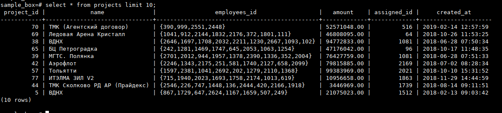

# Командная строка. DCL и TCL

**Преподаватель:** Николай Хащанов, Екатерина Волочаева

Работа выполняется с учебной базой данных HR - [letsdocode.ru...ain/hr.sql](https://letsdocode.ru/sql-main/hr.sql)

[ссылка на решения 2.x, 3.x в виде одного sql файла со всеми командами](part1.sql)


## **Задание 1. Работа с командной строкой** 

**1.1. Создайте новую базу данных с любым названием**

> Для выполнения задания создал VPS с предустановленным PostgreSQL (14).
> 
> Для локального соединения без проверки пароля пользователя ```postgres``` изменил режим аутентификации в конфиге [ pg_hba.conf](https://devmems.ru/library/article/16):
> 
```bash
 	# IPv4 local connections:
 	host    all     all     127.0.0.1/32      trust
 	# IPv6 local connections:
 	host    all     all     ::1/128           trust
 ```

```bash
# перезапуск сервера для применения политики аутентификации
systemstl restart postgresql 

# создаем базу данных sample_box
psql -h localhost -U postgres --command="create database sample_box;"

```

**1.2. Восстановите бэкап учебной базы данных в новую базу данных с помощью psql**

```bash
wget https://letsdocode.ru/sql-main/hr.sql
psql -h localhost -U postgres -d sample_box -v -f hr.sql

```

**1.3. Выведите список всех таблиц восстановленной базы данных**

```bash
\l # список БД
\c sample_box # подключился к БД sample_box
\dn # вывод списка схем
SET schema 'hr'; # переключился на схему 'hr' БД sample_box
\d # вывод списка таблиц схемы 'hr' БД sample_box
```


**1.4. Выполните SQL-запрос на выборку всех полей из любой таблицы восстановленной базы данных**

```sql
select * from projects limit 10;
```



>Пункты 1.1 и 1.2 выполняются в командной строке, пункты 1.3 и 1.4 выполняются в интерактивном режиме.

## **Задание 2. Работа с пользователями**  
> [ссылка на решения 2.x, 3.x в виде одного sql файла со всеми командами](part1.sql)

**2.1. Создайте нового пользователя MyUser, которому разрешен вход, но не задан пароль и права доступа.**  

```sql
create role "MyUser" with
	login
;
```

**2.2. Задайте пользователю MyUser любой пароль сроком действия до последнего дня текущего месяца.**  

```sql
-- use FORMAT('text with params %I %L', param[0],..,param[n]):
-- quote_ident() == %I
-- quote_literal() == %L

do $$
  declare
    userName text = 'MyUser';
	passwd varchar = (select md5(random()::text));
    end_of_month date = (select (date_trunc('month', now()) + interval '1 month - 1 day')::date);
  begin
   if exists (SELECT * FROM pg_catalog.pg_roles WHERE rolname = userName) then
     execute format('ALTER ROLE %I WITH PASSWORD %L VALID UNTIL %L', userName, passwd,end_of_month);
   end if;
     end;
$$ language plpgsql;

```

**2.3. Дайте пользователю MyUser права на чтение данных из двух любых таблиц восстановленной базы данных.** 

```sql

grant usage on schema hr to "MyUser";
grant select on address to "MyUser";
grant select on city to "MyUser";

```

**2.4. Заберите право на чтение данных ранее выданных таблиц**

```sql
revoke all on all tables in schema hr from "MyUser" cascade;
```

**2.5. Удалите пользователя MyUser.**

```sql
reassign owned by "MyUser" to postgres;
drop owned by "MyUser";
drop role "MyUser";
```


> Задание выполняется в DBeaver
> 

## **Задание 3. Работа с транзакциями**  
> [ссылка на решения 2.x, 3.x в виде одного sql файла со всеми командами](part1.sql)

 **3.1. Начните транзакцию**
 
```sql
begin
```

**3.2. Добавьте в таблицу projects новую запись**

```sql
INSERT INTO hr.projects (project_id,"name",employees_id,amount,assigned_id,created_at)
  select max(project_id)+1 ,'ТМК (Агентский договор)','{392,969,551,448}',1024.00,516,now() from hr.projects
;
```

**3.3. Создайте точку сохранения**

```sql
savepoint sp_33;
```

**3.4. Удалите строку, добавленную в п.3.2**

```sql
delete from hr.projects
where project_id in (select max(project_id)+1 from hr.projects)
```

**3.5. Откатитесь к точке сохранения**

```sql
rollback to sp_33;
```

**3.6. Завершите транзакцию**

```sql
commit;
```


> Задание выполняется в DBeaver

> По заданиям 1.3 и 1.4 в качестве решения пришлите скриншоты.  
> По заданиям 1.1, 1.2, 2.х и 3.х решение должны быть в виде [одного sql файла со всеми командами](part1.sql).
> 
