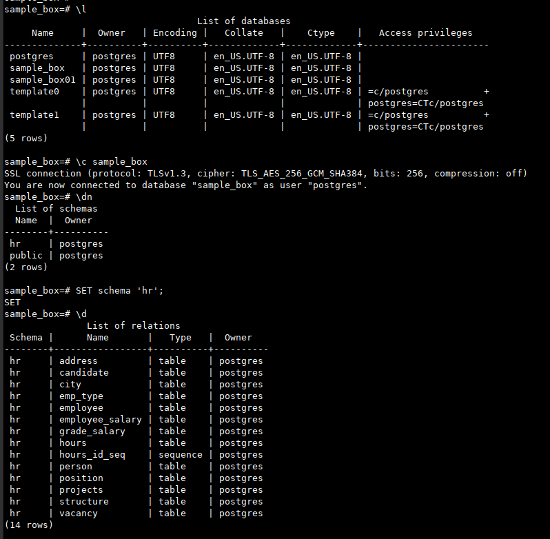

# Командная строка. DCL и TCL

**Преподаватель:** Николай Хащанов, Екатерина Волочаева

Работа выполняется с учебной базой данных HR - [letsdocode.ru...ain/hr.sql](https://letsdocode.ru/sql-main/hr.sql)

## **Задание 1. Работа с командной строкой**  
**1.1. Создайте новую базу данных с любым названием  **
> Для выполнения задания создал VPS с предустановленным PostgreSQL (14).
> Для локального соединения без проверки пароля пользователя ```postgres``` изменил режим аутентификации в конфиге [изменение в pg_hba.conf](https://devmems.ru/library/article/16):
> 
```bash
 	# IPv4 local connections:
 	host    all     all     127.0.0.1/32      trust
 	# IPv6 local connections:
 	host    all     all     ::1/128           trust
 ```

```bash
# перезапуск сервера для применения политики аутентификации
systemstl restart postgresql 

# создаем базу данных sample_box
psql -h localhost -U postgres 

```

**1.2. Восстановите бэкап учебной базы данных в новую базу данных с помощью psql**

```bash
wget https://letsdocode.ru/sql-main/hr.sql
psql -h localhost -U postgres -d sample_box -v -f hr.sql

```
**1.3. Выведите список всех таблиц восстановленной базы данных **

```bash
\l # список БД
\c sample_box # подключился к БД sample_box
\dn # вывод списка схем
SET schema 'hr'; # переключился на схему 'hr' БД sample_box
\d # вывод списка таблиц схемы 'hr' БД sample_box
```



**1.4. Выполните SQL-запрос на выборку всех полей из любой таблицы восстановленной базы данных**

```sql
select * from projects limit 10;
```


>Пункты 1.1 и 1.2 выполняются в командной строке, пункты 1.3 и 1.4 выполняются в интерактивном режиме.

## **Задание 2. Работа с пользователями**  
2.1. Создайте нового пользователя MyUser, которому разрешен вход, но не задан пароль и права доступа.  
2.2. Задайте пользователю MyUser любой пароль сроком действия до последнего дня текущего месяца.  
2.3. Дайте пользователю MyUser права на чтение данных из двух любых таблиц восстановленной базы данных.  
2.4. Заберите право на чтение данных ранее выданных таблиц  
2.5. Удалите пользователя MyUser.  
Задание выполняется в DBeaver

## **Задание 3. Работа с транзакциями**  
3.1. Начните транзакцию  
3.2. Добавьте в таблицу projects новую запись  
3.3. Создайте точку сохранения  
3.4. Удалите строку, добавленную в п.3.2  
3.5. Откатитесь к точке сохранения  
3.6. Завершите транзакцию.  
Задание выполняется в DBeaver

По заданиям 1.3 и 1.4 в качестве решения пришлите скриншоты.  
По заданиям 1.1, 1.2, 2.х и 3.х решение должны быть в виде одного sql файла со всеми командами.
