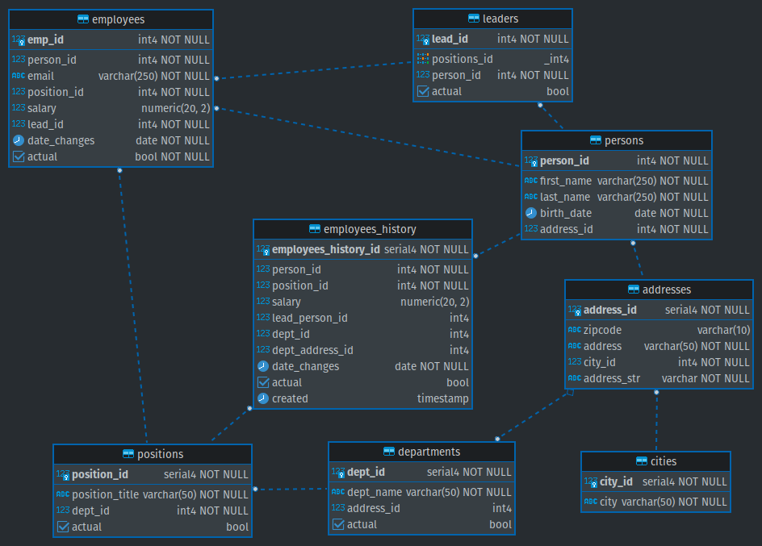

# Домашнее задание "Зависимости. Нормализация. Денормализация"


Вопросы по заданию

**Преподаватель:** Николай Хащанов, Екатерина Волочаева

- Исходная таблица: [letsdocode.ru...p_dz_3.csv](https://letsdocode.ru/sql-main/sqlp_dz_3.csv)
- [**sql файл - создание таблиц, триггера и функции**](part3.sql)
- [**sql файл для тестирования решения**](part3-test.sql)

**Задание**
**1.  Необходимо нормализовать исходную таблицу**

|**Поле исходной таблицы**| **Категории данных**| **Таблицы**|
|---|---|---|
|Фамилия и имя сотрудника| Сотрудники, Персональные данные | persons, employees, employees_history |
|Дата рождения| Персональные данные| persons |
|Электронная почта| Компания |employees|
|Адрес проживания (город, улица, номер дома)| Персональные данные| cities, adresses |
|Должность| Компания, История|positions, employees, employees_history|
|Департамент| Компания, Структура, История |departments, employees_history|
|Адрес департамента (город, улица, номер дома)| Компания, Структура, История| departments, cities, adresses, employees_history |
|Фамилия и имя руководителя| Структура, Сотрудники, Персональные данные, История| persons, leaders, employees, employees_history |
|Период работы| История|employees_history|
|Заработная плата| Компания, История|employees, employees_history|


**2. Получившиеся отношения должны быть не ниже 3 Нормальной Формы**

> 
> при создании таблиц со справочной информацией (медленно меняющиеся данные),  для `primary key`, использовал тип данных  `serial` 
> 


```sql
set search_path to hr_mod3;
-- === Адреса: cities, adresses ===

create table if not exists cities (
	city_id serial primary key,
	city varchar(50) not null
);

create table if not exists addresses (
	address_id serial primary key,
	zipcode varchar(10),
	address varchar(50) not null,
	city_id int4 not null,
	address_str varchar generated always as (address || ' ' || zipcode) stored not null
);

-- === Кадровые данные: перемещения и изменения окладов сотрудников ===
--- Персональные данные
create table if not exists persons (
	person_id int4 primary key,
	first_name varchar(250) not null,
	last_name varchar(250) not null,
	birth_date date not null,
	address_id int4 not null
);
--- Служебные данные, Сотрудники
create table if not exists employees (
	emp_id int4 primary key,
	person_id int4 not null,
	email varchar(250) not null,
	position_id int4 not null,
	salary numeric(20,2) default 0.00,	
	lead_id int4 not null,
	date_changes date not null default now(),
	actual bool not null default true
);

-- === Компания, Структура, Служебные данные ===
--- Структура
create table if not exists departments (
	dept_id serial primary key,
	dept_name varchar(50) not null,
	address_id int4,
	actual bool default true
);
create table if not exists positions (
	position_id serial primary key,
	position_title varchar(50) not null,
	dept_id int4 not null,
	actual bool default true
);
-- Руководители
create table if not exists leaders (	
	lead_id int4 primary key,
	positions_id int4[],
	person_id int4 not null,
	actual bool default true
);


--- === Сonstraintы table add ===
---- Адреса: cities, adresses
alter table addresses
  add constraint address_city_id_fk foreign key (city_id) references cities(city_id)
;

---- Кадры: персональные данные
alter table persons
  add constraint persons_address_id_fk foreign key (address_id) references addresses(address_id)
;

---- Сотрудники 
alter table employees
  add constraint employees_person_id_fk foreign key (person_id) references persons(person_id), 
  add constraint employees_position_id_fk foreign key (position_id) references positions(position_id),
  add constraint employees_lead_id_fk foreign key (lead_id) references leaders(lead_id)
;

---- Кадры: перемещения и изменения окладов сотрудников  
---- Структура
alter table departments
  add constraint departments_address_id_fk foreign key (address_id) references addresses(address_id)
;

alter table positions
  add constraint positions_department_id_fk foreign key (dept_id) references departments(dept_id)
;

---- Руководители
alter table leaders 
  add constraint leaders_person_id_fk foreign key (person_id) references persons(person_id)
;
```

**3.  В результате должна быть диаграмма из не менее чем 5 нормализованных отношений и 1 таблицы с историчностью, соответствующей требованиям SCD4**

>
>Историчность с типом SCD4 применил к данным о кадровых изменениях сотрудника - должность, зар.плата, руководитель,  период, информация о департаменте.
>

```sql
--- Перемещения и изменения окладов сотрудников
---- для хранения истории карьеры сотрудника: 
---- занимаемая должность и зар.плата на дату изменения, руководитель 
create table if not exists employees_history (
    employees_history_id serial primary key,
	person_id int4 not null,
	position_id int4 not null,
	salary numeric(20,2) default 0.00,
	lead_person_id int4,
	dept_id int4,
	dept_address_id int4,
	date_changes date not null,
	actual bool,
	created timestamp default current_timestamp
);
alter table employees_history
  add constraint employees_history_position_id_fk foreign key (position_id) references positions(position_id),
  add constraint employees_history_person_id_fk foreign key (person_id) references persons(person_id)
;
```


**4.  Контролировать целостность данных в таблице с историчными данными необходимо с помощью триггерной функции**

```sql
create or replace function employees_history_func() returns trigger
as $$
declare 
begin
  if tg_op = 'UPDATE' and new.emp_id in (select emp_id from employees) then
    insert into employees_history (person_id, position_id, salary, lead_person_id, dept_id, dept_address_id, date_changes, actual)
	  (
		with t as (select e.emp_id, e.person_id, e.position_id, e.salary, e.date_changes, e.actual, l.person_id lead_person_id, dp.dept_id, dp.address_id address_id
		from employees e
		join (
		  select *
		  from positions p 
		  join departments d using (dept_id)
		) dp using (position_id)
		join leaders l using (lead_id))
		select person_id, position_id, salary, lead_person_id, dept_id, address_id, date_changes, actual  
		from t
		where emp_id = new.emp_id
      );
     return new;
   else
     return new;
	end if;
end;
$$ language plpgsql;
create or replace trigger salary_history_trigger
after insert or update on employees 
for each row execute function employees_history_func()
;
```


**5.  Результат работы должен быть в виде одного скриншота ER-диаграммы и sql запроса с триггером и функцией**


