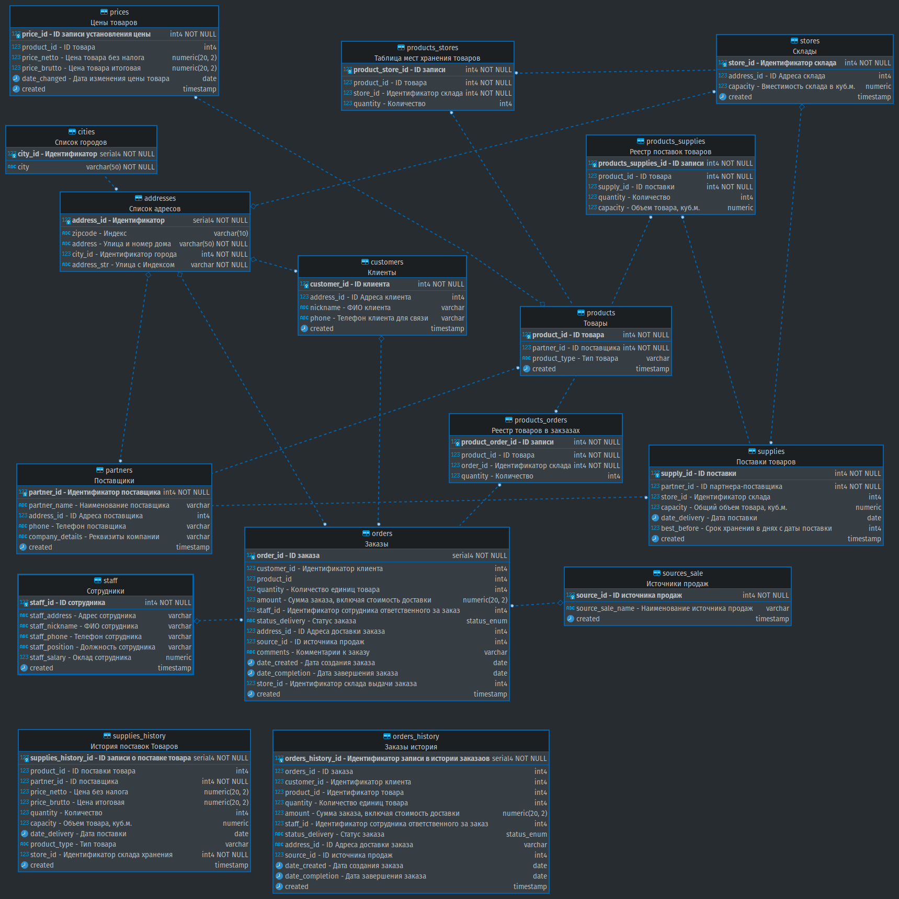

# Домашнее задание

Необходимо реализовать логическую схему базы. 
На логическом уровне должна быть детализирована концептуальная схема. Нормализованы отношения и сформированы все необходимые связи. Сформированы необходимые атрибуты, конкретизированы типы данных и все необходимые ограничения. При необходимости сформирована денормализация и учтена историчность. Можно словами прописать, какие нужно создать процедуры и функции для автоматизации, какие уровни доступа будут, сколько потребуется серверов и какие типы СУБД можно использовать.

**Необходимо:**
- Детализировать каждое отношение;
- Детализировать таблицу Заказ: вынести доставку, сформировать товар-заказ, учесть сотрудников задействованных в заказе и т.д;
- Детализировать доставку (курьер, адрес, стоимость, статус, etc);
- Создать и детализировать типы товаров;
- Предусмотреть необходимость формирования отношения многие ко многим Склад-Товар;
- На свое усмотрение отрисуйте денормализованные отчеты и историчность.

## **Концептуальная схема данных. Доставка цветов**

**Сущности:**
●	suppliers - поставщики. 
●	stores - склады. 
●	customers - клиенты.
●	staff - сотрудники.
●	products - товар. 
●	source_sale - источники продаж.
●	orders - заказы.

**Задачи, которые нужно решить:**
●	Планирование, БДР      
●	Контроль удовлетворенности клиента      
●	Интеграция с web / crm      
●	Формирование клиентской базы      
●	Определение эффективных и неэффективных источников продажи  
●	Формирование базы поставщиков      
●	Учет товара (тмц, ос, склад и так далее)      
●	Учет эффективности сотрудников 

## **Решение**

Реализована логическая схема `flowers_delivery_db` (скриншот ниже)
Скрипты создания схемы: 
1. [Создание таблиц в схеме](part4.sql)
2. [Добавление ограничений](part4-constraints.sql)
3. [Добавление описаний полей таблиц](part4-comments.sql);

**Описание**

**Для оперативной работы** созданы следующие таблицы: 

- `prices` - Реестр изменения цен товаров;
- `supplies` - Реестр поставок товаров;
- `products_stores` - Таблица распределения товаров по местам хранения товаров;
- `orders` - Реестр заказов;
- `partners` - Справочная информация поставщиков продукции;
- `stores` - Справочная информация  складов для хранения и выдачи заказов;
- `customers` - Справочная информация  клиентов;
- `staff` - Справочная информация  персонала;
- `products` - Справочная информация  Товаров;
- `sources_sale` - Справочная информация источников продаж;
- `cities` - Справочная информация  городов;
- `addresses` - Справочная информация  адресов клиентов и складов;
- `status_enum` - Справочник статусов Заказов (`enum ('created', 'queue', 'accepted', 'delivered', 'canceled', 'exception', 'returning')`);

и функции (на словах):
- "Создания заказа с назначением ближайшего склада по индексу из адресной информации";
- "Смена статуса заказа";
- "Изменение остатка товаров в `supplies` при создании/отмене заказа ";
- "Утилизация товаров по истечении срока хранения".

**Для реализации бизнес-требований:** Планирование, БДР,Определение эффективных и неэффективных источников продажи, Учет эффективности сотрудников дополнительно созданы таблицы:

- `supplies_history` - Реестр истории поставок Товаров;
- `orders_history` - Реестр истории заказов;

и триггерные функции (на словах) для наполнения таблиц с историей:
- "Создание записи в `orders_history` при заполнении поля дата доставки";
- "Создание записи `supplies_history` при добавлении записи в `supplies`";

Дополнительно в логическую схему необходимо добавить представления:

- "Отчет о продажах за период с разрезами: сотрудник, товары и их типы, регионы поставок";
- "Отчет о поставках за период с разрезами: по поставщикам, товарам, типам товаров";
- "Отчет о заказах за период с разрезами: создано-выполнено-отменено";
- "Отчет о сроках хранения товаров с разрезами по товарам и их типам";
- "Отчет о местах хранения с разрезами: склады, остатки товаров, утилизация пространства";

